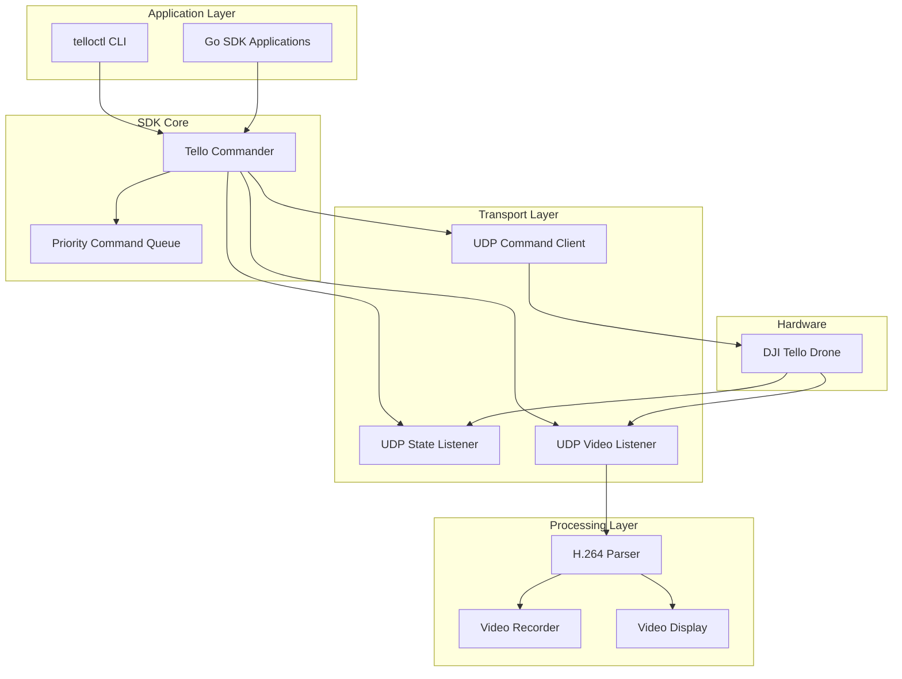
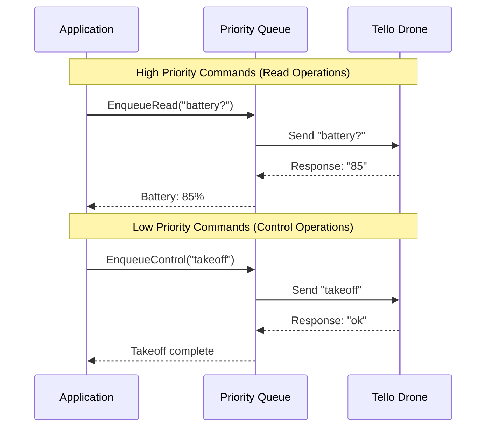
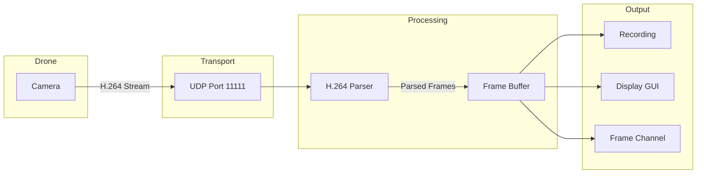

# DJI Tello Go SDK

A comprehensive and easy-to-use Go SDK for the DJI Tello drone, featuring priority command queuing, real-time video streaming, and extensive telemetry capabilities.

## Features

- 🚁 **Complete Drone Control** - Takeoff, landing, movement, flips, and advanced flight patterns
- 📹 **Video Streaming** - Real-time H.264 video stream processing and display
- 🎥 **Video Recording** - H.264 and MP4 recording with FFmpeg integration
- 📊 **Telemetry Monitoring** - Real-time battery, altitude, attitude, and sensor data
- ⚡ **Priority Command Queue** - Intelligent command prioritization for responsive control
- 🖥️ **CLI Tool** - Comprehensive command-line interface (`telloctl`)
- 🌐 **Web Interface** - Browser-based video display and control
- 🔧 **Modular Architecture** - Clean, testable, and extensible design

## Installation

```bash
go get github.com/conceptcodes/dji-tello-sdk-go
```

### Dependencies

For video recording (MP4 format), install FFmpeg:
```bash
# macOS
brew install ffmpeg

# Ubuntu/Debian
sudo apt-get install ffmpeg

# Windows
# Download from https://ffmpeg.org/download.html
```

## Quick Start

```go
package main

import (
    "log"
    "time"
    "github.com/conceptcodes/dji-tello-sdk-go/pkg/tello"
)

func main() {
    // Initialize the drone
    drone, err := tello.Initialize()
    if err != nil {
        log.Fatal(err)
    }

    // Enter SDK mode
    if err := drone.Init(); err != nil {
        log.Fatal(err)
    }

    // Take off
    if err := drone.TakeOff(); err != nil {
        log.Fatal(err)
    }

    // Fly in a square
    drone.Forward(100)
    drone.Right(100)
    drone.Backward(100)
    drone.Left(100)

    // Land
    if err := drone.Land(); err != nil {
        log.Fatal(err)
    }
}
```

## Architecture

### High Level Architecture



### Priority Command Queue

The SDK implements a priority-based command queue to ensure responsive drone control:



### Video Streaming Pipeline



## Video Streaming

The SDK now supports real-time video streaming from DJI Tello drone. The video stream provides H.264 encoded video data that can be processed, saved, or displayed.

### Basic Usage

```go
package main

import (
    "fmt"
    "log"
    "time"
    
    "github.com/conceptcodes/dji-tello-sdk-go/pkg/tello"
)

func main() {
    // Initialize the Tello commander
    commander, err := tello.Initialize()
    if err != nil {
        log.Fatalf("Failed to initialize: %v", err)
    }

    // Enter SDK mode
    if err := commander.Init(); err != nil {
        log.Fatalf("Failed to enter SDK mode: %v", err)
    }

    // Start video streaming
    if err := commander.StreamOn(); err != nil {
        log.Fatalf("Failed to start video stream: %v", err)
    }

    // Set up video frame callback
    commander.SetVideoFrameCallback(func(frame tello.VideoFrame) {
        fmt.Printf("Received frame: %d bytes, keyframe: %v\n", 
            frame.Size, frame.IsKeyFrame)
    })

    // Or use channel-based approach
    frameChan := commander.GetVideoFrameChannel()
    go func() {
        for frame := range frameChan {
            // Process video frame
            fmt.Printf("Frame %d: %d bytes\n", frame.SeqNum, frame.Size)
        }
    }()

    // Keep running
    time.Sleep(30 * time.Second)

    // Stop video streaming
    commander.StreamOff()
}
```

### Video Recording

```go
import "github.com/conceptcodes/dji-tello-sdk-go/pkg/transport"

// Create a video recorder (H.264 format)
recorder, err := transport.NewVideoRecorder(":11111", "output.h264")
if err != nil {
    log.Fatal(err)
}

// Or create an MP4 video recorder
mp4Recorder, err := transport.NewVideoRecorderMP4(":11111", "output.mp4")
if err != nil {
    log.Fatal(err)
}

// Start recording
if err := recorder.StartRecording(); err != nil {
    log.Fatal(err)
}

// Record for 30 seconds
time.Sleep(30 * time.Second)

// Stop recording
recorder.StopRecording()
```

### CLI Commands

The `telloctl` CLI now includes video streaming commands:

```bash
# Start video streaming
telloctl streamon

# Stop video streaming  
telloctl streamoff

# Monitor video stream with statistics
telloctl stream

# Monitor for 60 seconds and save to file (H.264)
telloctl stream -d 60 -s video.h264

# Monitor for 60 seconds and save to MP4 file
telloctl stream -d 60 -s video.mp4 -f mp4

# Start video GUI (web interface)
telloctl video-gui

# Start video GUI (terminal interface)
telloctl video-gui -t terminal
```

### Video Frame Structure

Each video frame contains:

- `Data`: Raw H.264 video data
- `Timestamp`: When the frame was received
- `Size`: Frame size in bytes
- `SeqNum`: Frame sequence number
- `NALUnits`: Parsed H.264 NAL units
- `IsKeyFrame`: Whether the frame contains a keyframe

### H.264 Parsing

The SDK includes H.264 parsing capabilities:

```go
parser := transport.NewH264Parser()
nalUnits, err := parser.ParseFrame(frame.Data)
if err != nil {
    log.Printf("Failed to parse frame: %v", err)
    return
}

// Check for keyframes
hasKeyFrame := parser.HasKeyFrame(nalUnits)

// Get frame information
info := parser.GetFrameInfo(nalUnits)
fmt.Printf("NAL units: %v\n", info["nal_types"])
```

## CLI Tool

The SDK includes a comprehensive CLI tool `telloctl` for drone control and monitoring.

### Installation

```bash
go install github.com/conceptcodes/dji-tello-sdk-go/cmd/telloctl@latest
```

### Commands

#### Control Commands
```bash
# Initialize drone
telloctl init

# Takeoff and landing
telloctl takeoff
telloctl land

# Movement
telloctl up 50        # Move up 50cm
telloctl forward 100  # Move forward 100cm
telloctl clockwise 90 # Rotate 90 degrees clockwise

# Emergency stop
telloctl emergency
```

#### Telemetry Commands
```bash
# Get battery level
telloctl battery

# Get height
telloctl height

# Get attitude (pitch, roll, yaw)
telloctl attitude

# Monitor all telemetry
telloctl telemetry
```

#### Video Commands
```bash
# Start/stop video streaming
telloctl streamon
telloctl streamoff

# Monitor video stream
telloctl stream -d 30 -s output.mp4 -f mp4

# Start video GUI
telloctl video-gui -t web -p 8080
```

## API Reference

### Core Interface

```go
type TelloCommander interface {
    // Control Commands
    Init() error
    TakeOff() error
    Land() error
    StreamOn() error
    StreamOff() error
    Emergency() error
    
    // Movement Commands
    Up(distance int) error
    Down(distance int) error
    Left(distance int) error
    Right(distance int) error
    Forward(distance int) error
    Backward(distance int) error
    Clockwise(angle int) error
    CounterClockwise(angle int) error
    Flip(direction FlipDirection) error
    Go(x, y, z, speed int) error
    Curve(x1, y1, z1, x2, y2, z2, speed int) error
    
    // Settings Commands
    SetSpeed(speed int) error
    SetRcControl(a, b, c, d int) error
    SetWiFiCredentials(ssid, password string) error
    
    // Read Commands
    GetSpeed() (int, error)
    GetBatteryPercentage() (int, error)
    GetTime() (int, error)
    GetHeight() (int, error)
    GetTemperature() (int, error)
    GetAttitude() (int, int, int, error)
    GetBarometer() (int, error)
    GetAcceleration() (int, int, int, error)
    GetTof() (int, error)
    
    // Video Commands
    SetVideoFrameCallback(callback VideoFrameCallback)
    GetVideoFrameChannel() <-chan transport.VideoFrame
}
```

## Examples

### Basic Flight Control

```go
package main

import (
    "log"
    "time"
    "github.com/conceptcodes/dji-tello-sdk-go/pkg/tello"
)

func main() {
    drone, err := tello.Initialize()
    if err != nil {
        log.Fatal(err)
    }

    drone.Init()
    drone.TakeOff()
    
    // Fly a square pattern
    drone.Forward(100)
    drone.Right(100)
    drone.Backward(100)
    drone.Left(100)
    
    drone.Land()
}
```

### Video Recording

```go
package main

import (
    "log"
    "time"
    "github.com/conceptcodes/dji-tello-sdk-go/pkg/tello"
    "github.com/conceptcodes/dji-tello-sdk-go/pkg/transport"
)

func main() {
    drone, err := tello.Initialize()
    if err != nil {
        log.Fatal(err)
    }

    drone.Init()
    drone.StreamOn()

    // Create MP4 recorder
    recorder, err := transport.NewVideoRecorderMP4(":11111", "flight.mp4")
    if err != nil {
        log.Fatal(err)
    }

    recorder.StartRecording()
    
    // Record during flight
    drone.TakeOff()
    time.Sleep(2 * time.Second)
    drone.Forward(100)
    time.Sleep(2 * time.Second)
    drone.Land()
    
    recorder.StopRecording()
    drone.StreamOff()
}
```

### Telemetry Monitoring

```go
package main

import (
    "fmt"
    "log"
    "time"
    "github.com/conceptcodes/dji-tello-sdk-go/pkg/tello"
)

func main() {
    drone, err := tello.Initialize()
    if err != nil {
        log.Fatal(err)
    }

    drone.Init()

    // Monitor telemetry
    ticker := time.NewTicker(1 * time.Second)
    defer ticker.Stop()

    for i := 0; i < 30; i++ {
        select {
        case <-ticker.C:
            battery, _ := drone.GetBatteryPercentage()
            height, _ := drone.GetHeight()
            pitch, roll, yaw, _ := drone.GetAttitude()
            
            fmt.Printf("Battery: %d%%, Height: %dcm, Attitude: P:%d R:%d Y:%d\n",
                battery, height, pitch, roll, yaw)
        }
    }
}
```

## Development

### Building

```bash
# Build CLI tool
go build -o telloctl ./cmd/telloctl

# Run tests
go test ./...

# Run tests with coverage
go test -cover ./...
```

### Project Structure

```
.
├── cmd/
│   └── telloctl/           # CLI application
│       └── commands/       # CLI command implementations
├── pkg/
│   ├── tello/             # Core SDK functionality
│   │   ├── commander.go   # Main drone interface
│   │   └── priority_command_queue.go  # Command queuing
│   ├── transport/         # Communication layer
│   │   ├── video.go       # Video streaming
│   │   ├── h264_parser.go # H.264 parsing
│   │   ├── mp4_recorder.go # Video recording
│   │   └── state.go       # Telemetry
│   └── utils/             # Utilities
└── examples/              # Example applications
```

## Contributing

1. Fork the repository
2. Create a feature branch (`git checkout -b feature/amazing-feature`)
3. Commit your changes (`git commit -m 'Add amazing feature'`)
4. Push to the branch (`git push origin feature/amazing-feature`)
5. Open a Pull Request

## License

This project is licensed under the MIT License - see the [LICENSE](LICENSE) file for details.

## Roadmap

- [x] Video streaming support
- [x] Priority command queuing
- [x] MP4 recording with FFmpeg
- [x] Web-based video GUI
- [ ] Gamepad support
- [ ] Basic ML support
- [ ] Swarm manager
- [ ] Flight path planning
- [ ] Advanced telemetry analytics

## References

- [DJI Tello 1.3 SDK Documentation](https://dl-cdn.ryzerobotics.com/downloads/tello/20180910/Tello%20SDK%20Documentation%20EN_1.3.pdf)
- [H.264/MPEG-4 AVC Video Compression Standard](https://www.itu.int/rec/T-REC-H.264)